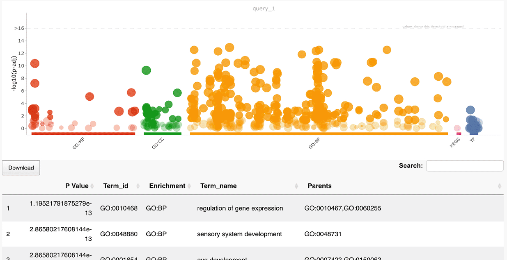

## GO Enrichment
---
The enrichment part is based on gProfileR. 

      

 

To obtain your associated GO terms and/or KEGG/Wiki Pathways/Reactome/TRANSFAC/Human Atlas/CORUM/MirTarBase enrichment  with description in a nice table and graph, just paste a ids list.

-  <u> As input </u>  
Paste a list of ids of interest 

- <u> Enrichment </u>  
Choose the  enrichment you want and specify some parameters.
(results are sorted from the most significant p-value to the least). 

 
 
