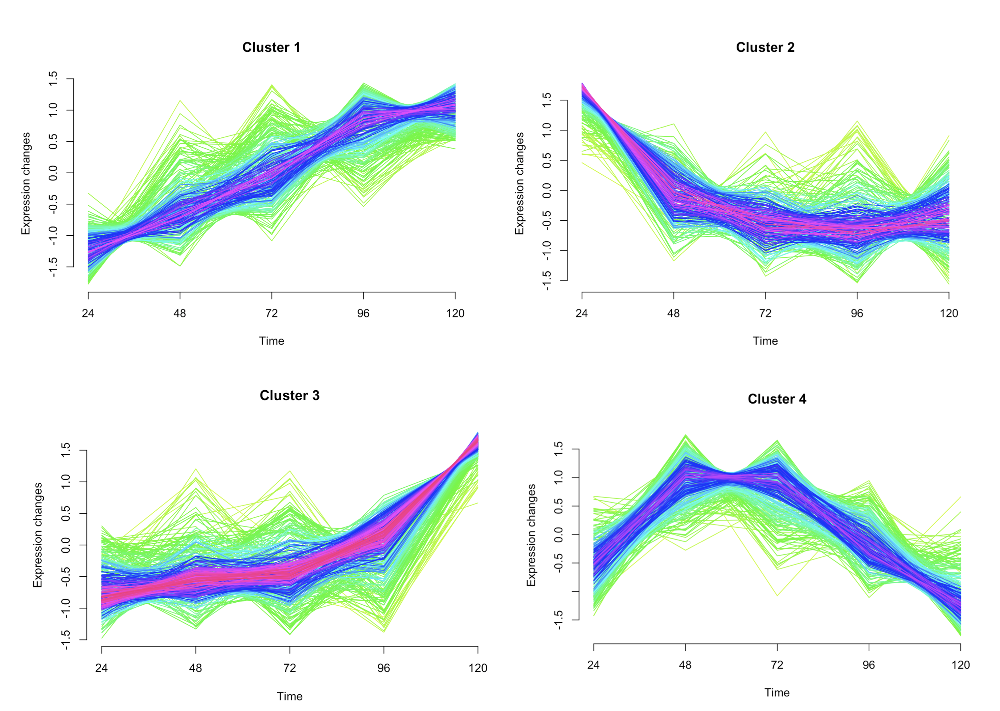

## Mfuzz clustering
---
Mfuzz is a Clustering tool for  RNAseq data using fuzzy c-means clustering.   
It performs soft clustering of genes based on their expression values using the fuzzy c-means algorithm.  
By uploading a csv file of gene expression per time points, you can obtain this kind of plots : 

      

### <u> Choosing the number of clusters </u>  
To help choosing the number of clusters, there are two methods, the <b> inertia </b> and the <b> elbow </b> methods.   

- <b> Inertia Method </b> 
The inertia method consists on choosing the number of clusters corresponding to the point where the inertia drop gets minimal.  

- <b> Elbow Method </b> 
The elbow method consists on plotting the Within Sum of Squared (WSS) along the number of clusters. The <i> right </i> number of clusters corresponds to the point where the line forms a elbow.  

- <b> Checking overlap </b> 
If the number of clusters is too big, some clusters can overlap.  
This can be checked in the overlap PCA.   

### <u> Mfuzz Plots </u>  

The plots are showing automatically and a download button is available where files of clusters with membership values will be saved on your computer's desktop.  
You will obtain as many file as the number of clusters you have. 
We recommend to previously create a specific folder and modify line 154 of server-mfuzz.r file to include the folder.
 
 
