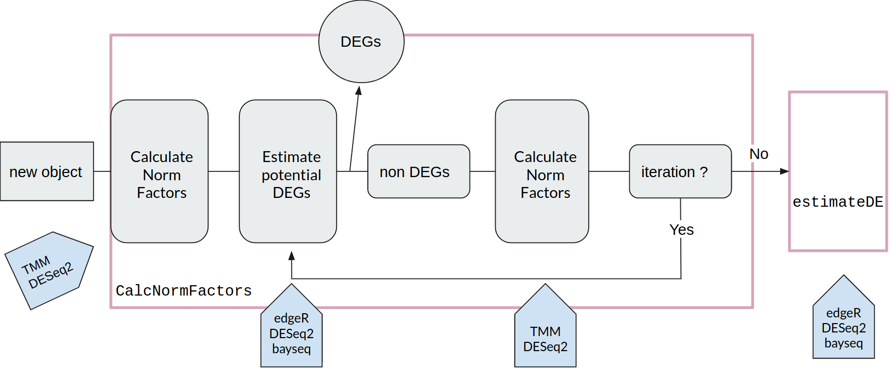

[TCC](https://www.ncbi.nlm.nih.gov/pubmed/23837715) (Tag Count Comparison) package provides functions to perform differential expression analysis from RNA-seq count data. The normalization strategy called DEGES is essential for noramlization accuracy.
DEGES is based on the idea that potential differentially expressed genes (DEGs) should be removed before normalization of the data. 
The goal is to obtain a ranked gene list where true DEGs are top-ranked. 

      

In our case, the iteration value is set to default value 3.

 
### Normalization Methods
---
- [TMM](https://www.ncbi.nlm.nih.gov/pubmed/20196867) : Trimmed Mean of M values is an empirical strategy that equates the overall expression levels of genes between samples under the assumption that the majority of them are not DE. 

- [DESeq2](https://www.ncbi.nlm.nih.gov/pmc/articles/PMC4302049/) : uses the median of ratios method, and negative binomial generalized linear models; the estimates of dispersion and logarithmic fold changes incorporate data-driven prior distributions.

### DEG Identification Methods
---
Identifying DEGs by using the estimateDE function with test.method = "edger", "deseq2" or "bayseq".

- [EdgeR](https://doi.org/10.1093/bioinformatics/btp616) : overdispersed Poisson model is used to account for both biological and technical variability. Empirical Bayes methods are used to moderate the degree of overdispersion across transcripts, improving the reliability of inference.

- [DESeq2](https://www.ncbi.nlm.nih.gov/pmc/articles/PMC4302049/) : uses shrinkage estimation for dispersions and fold changes to improve stability and interpretability of estimates. This enables a more quantitative analysis focused on the strength rather than the mere presence of differential expression. (Recommanded using replicates) 

- [baySeq](https://doi.org/10.1186/1471-2105-11-422) : uses an empirical Bayesian approach to define patterns of differential expression and detect these patterns within a set of sequencing samples.
The method assumes a negative binomial distribution for the data and derives an empirically determined prior distribution from the entire dataset.

### FDR Cut-Off 
---
Specifie the threshold for determining DEGs.

### Elimination of Potential DEGs
---
Specifie the minimum value to be eliminated as potential DEGs.

